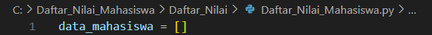
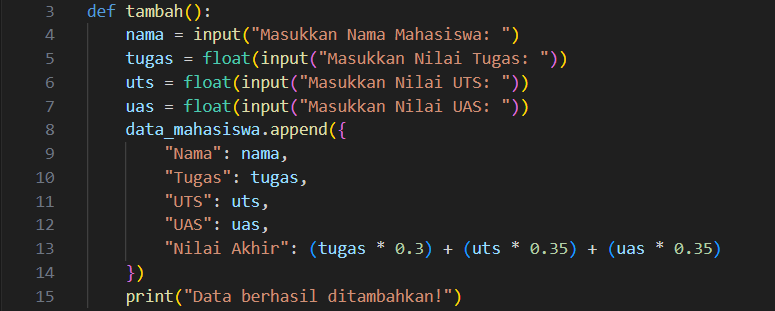
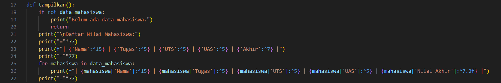
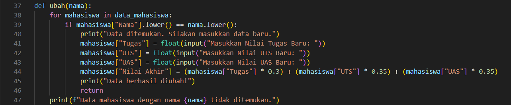
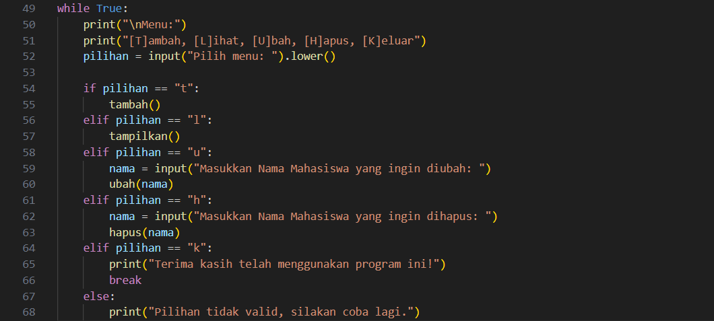
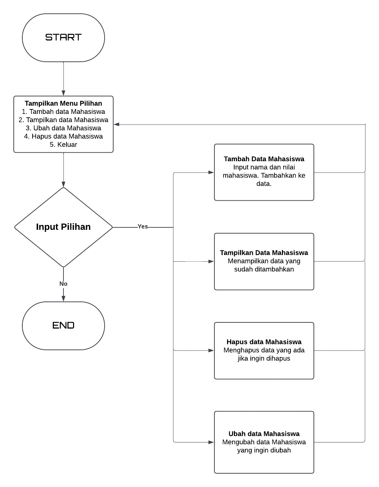
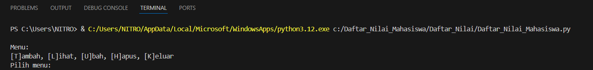
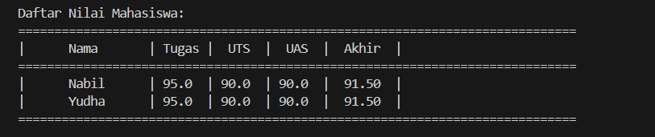

# Data Nilai Mahasiswa
Nama    : Nabil Putra Alamsyah
Nim     : 312410376

Program ini adalah aplikasi sederhana berbasis Python untuk mengelola data nilai mahasiswa. Aplikasi ini memanfaatkan fungsi-fungsi untuk menambahkan, menampilkan, mengubah, dan menghapus data mahasiswa dengan format yang mudah digunakan.

## Fitur Utama
    -Menambahkan Data Mahasiswa: Memasukkan nama mahasiswa beserta nilai tugas, UTS, dan UAS.
    -Menampilkan Data Mahasiswa: Menampilkan semua data mahasiswa dalam format tabel.
    -Menghapus Data Mahasiswa: Menghapus data mahasiswa berdasarkan nama.
    -Mengubah Data Mahasiswa: Mengubah nilai mahasiswa berdasarkan nama.

## Struktur Program
    1. tambah()
        Fungsi untuk menambahkan data mahasiswa.

    2. tampilkan()
        Fungsi untuk menampilkan semua data mahasiswa.

    3. hapus(nama)
        Fungsi untuk menghapus data mahasiswa berdasarkan nama.

    4. ubah(nama)
        Fungsi untuk mengubah data mahasiswa berdasarkan nama.

## Langkah - langkah membuat program :

### 1. Membuat Struktur Data untuk Menyimpan Data Mahasiswa
        - Gunakan list untuk menyimpan data mahasiswa.
        - Setiap mahasiswa akan disimpan sebagai dictionary yang berisi nama, nilai tugas, UTS, UAS, dan nilai akhir.

### 2. Fungsi Tambah()
        - Tambahkan fungsi untuk memasukkan data mahasiswa.
        - Gunakan input dari pengguna untuk mendapatkan nama, nilai tugas, UTS, dan UAS.
        - Hitung nilai akhir berdasarkan bobot.
        - Simpan data mahasiswa ke dalam list data_mahasiswa.

### 3. Fungsi tampilkan()
        - Tambahkan fungsi untuk mencetak semua data mahasiswa.
        - Tampilkan data dalam format tabel.
    

### 4. Fungsi hapus(nama)
        - Tambahkan fungsi untuk menghapus data mahasiswa berdasarkan nama.
        - Gunakan perulangan untuk mencari mahasiswa dengan nama yang diberikan.

### 5. Fungsi ubah(nama)
        - Tambahkan fungsi untuk mengubah data mahasiswa berdasarkan nama.
        - Jika ditemukan, minta input nilai baru dan perbarui data.

### 6. Buat Menu Utama
        - Tambahkan logika utama untuk menampilkan menu dan memanggil fungsi berdasarkan pilihan pengguna.

### 7. Flowchart

### 8. Penjelasan Akhir
    - Program menggunakan list untuk menyimpan data mahasiswa.
    - Setiap operasi dilakukan melalui fungsi, sehingga mudah dipelihara dan dikembangkan.
    - Menu utama memberikan antarmuka sederhana untuk pengguna.

## 9. Contoh Output
    - Menu Utama :

    - Menu Tabel Data Mahasiswa :

